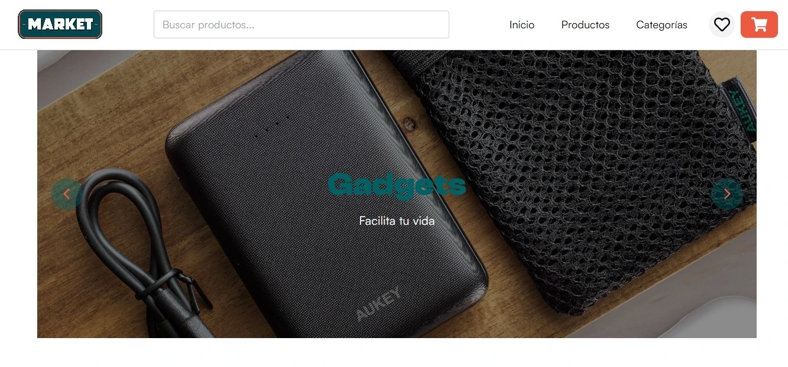
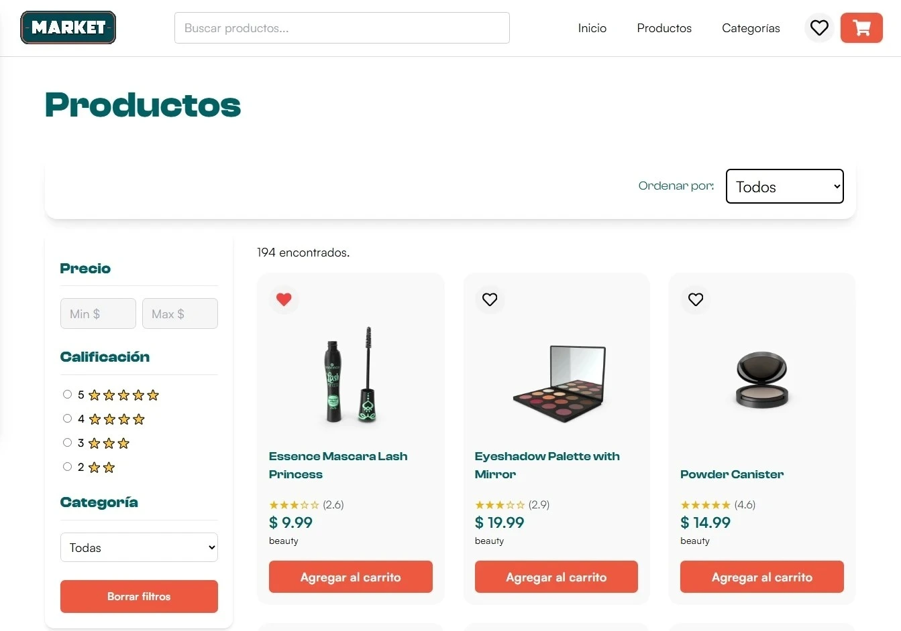
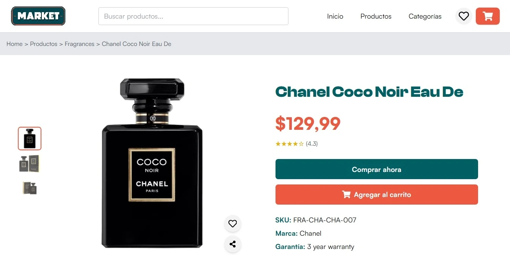
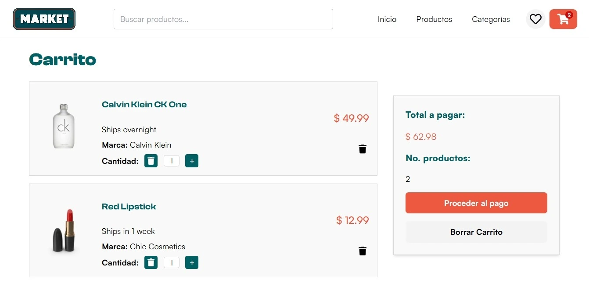
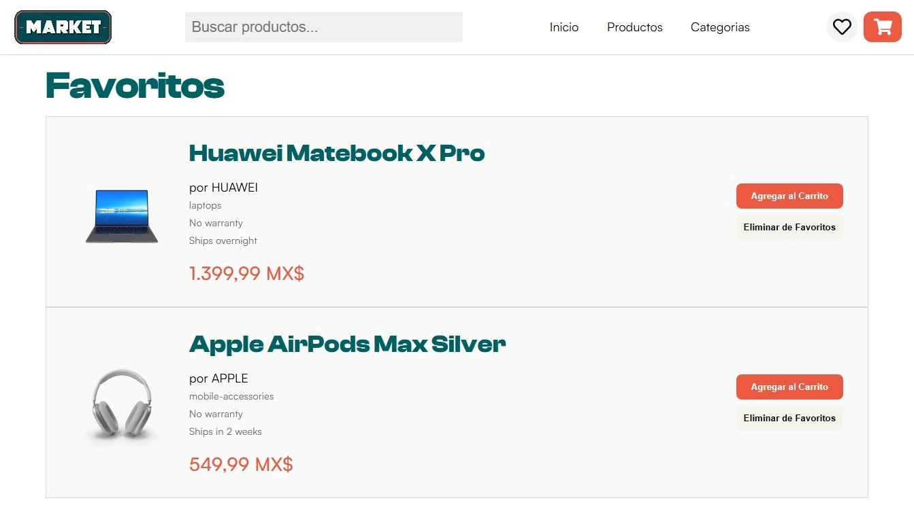
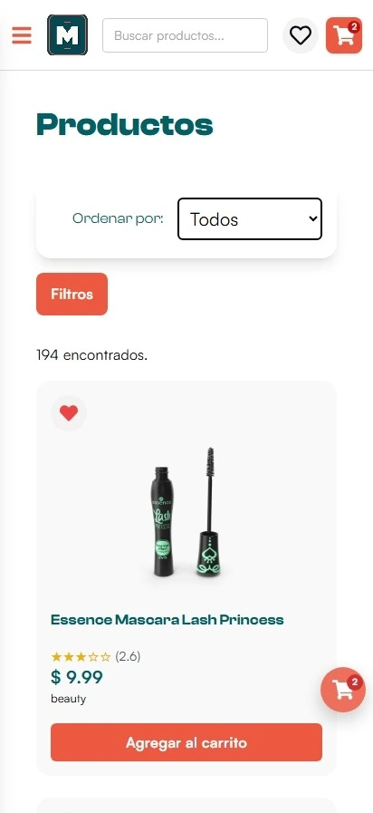
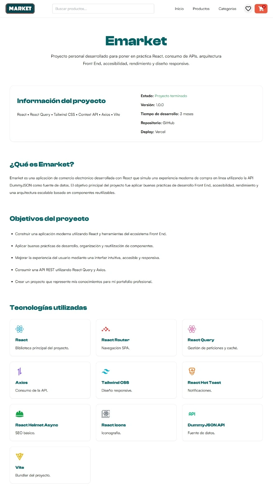

# 🛒 Emarket

Una aplicación de comercio electrónico desarrollada con React que simula una experiencia moderna de compra en línea utilizando la API DummyJSON. Proyecto personal desarrollado para fortalecer conocimientos en React, React Query, TailwindCSS, Context API y buenas prácticas de desarrollo Front End.

## ✨ Demo

🔗 **Aplicación desplegada en Vercel**

🚀 https://proyecto-ecommerce-peach.vercel.app/

## 🎯 Objetivo

El objetivo de Emarket fue desarrollar una aplicación de comercio electrónico moderna aplicando buenas prácticas de desarrollo Front End, accesibilidad, optimización de rendimiento y una arquitectura escalable utilizando React y tecnologías del ecosistema moderno.

## 📷 Capturas
### 🏠 Inicio



## Galería

| Productos | Detalle del producto |
|-----------|----------|
|  |  |

| Carrito | Favoritos |
|---------|------------|
|  |  |

| Responsive | Acerca del proyecto |
|-----------|----------|
|  |  |

## 🚀 Características

### Compra

- Catálogo de productos
- Detalle del producto
- Carrito
- Favoritos

### Navegación

- Breadcrumb
- Productos vistos recientemente
- Compartir productos

### Experiencia de usuario

- Skeleton Loading
- Responsive Design
- Animaciones
- Accesibilidad

### Optimización

- SEO básico

## 🌟 Aspectos destacados
- Arquitectura basada en componentes reutilizables.
- Hooks personalizados para encapsular lógica.
- Gestión global mediante Context API.
- React Query para optimizar las peticiones.
- Responsive Design Mobile First.
- Skeleton Loaders para mejorar la percepción de carga.
- Web Share API con fallback para navegadores incompatibles.
- Optimización SEO mediante React Helmet Async.
- Accesibilidad siguiendo recomendaciones de Lighthouse.

## 🛠 Tecnologías

| Tecnología | Uso |
|-----------|----------|
| React | Construcción de la interfaz |
| Vite | Bundler |
| React Router | Navegación |
| React Query | Gestión de datos y caché |
| Axios | Consumo de APIs REST |
| TailwindCSS | Estilos |
| React Hot Toast | Notificaciones |
| React Helmet Async | SEO |
| Context API | Estado Global |

## 📂 Arquitectura

```text
src
├── api          # Peticiones HTTP
├── components   # Componentes reutilizables
├── context      # Estado global
├── hooks        # Hooks personalizados
├── layouts      # Layout principal
├── pages        # Páginas
├── routes       # Configuración de rutas
└── utils        # Funciones auxiliares
```

## 🏗 Arquitectura

El proyecto sigue una arquitectura basada en componentes reutilizables.

- Components → UI reutilizable.
- Hooks → Lógica reutilizable.
- Context → Estado global.
- API → Comunicación con servicios externos.
- Pages → Pantallas principales.
- Layouts → Estructura compartida.

## ⚙ Instalación

```bash
git clone https://github.com/angelhdzglr-prog/Proyecto-Ecommerce.git

cd Proyecto-Ecommerce

npm install

npm run dev
```
## 📌 Estado del proyecto
Emarket continúa en desarrollo activo. Actualmente implementa las funcionalidades principales de un comercio electrónico moderno y seguirá evolucionando incorporando nuevas características, mejoras de rendimiento y buenas prácticas de desarrollo Front End.

## 🧩 Retos durante el desarrollo

- Diseñar una galería de imágenes adaptable para escritorio y dispositivos móviles.
- Implementar filtros y ordenamientos manteniendo una buena experiencia de usuario.
- Gestionar el estado global del carrito, favoritos y productos vistos recientemente.
- Crear un historial persistente mediante LocalStorage.
- Integrar React Query para optimizar las peticiones y la caché.
- Implementar la Web Share API con fallback para navegadores incompatibles.
- Optimizar la aplicación para dispositivos móviles siguiendo un enfoque Mobile First.

## 📚 Lo que aprendí

Durante el desarrollo de Emarket fortalecí mis conocimientos en React, Context API, React Query, optimización de rendimiento, accesibilidad, SEO y diseño responsive, aplicando buenas prácticas para construir una aplicación escalable y reutilizable.

## 🔮 Próximas mejoras

### Funcionalidades
- Login
- Checkout
- Base de datos
- Paginación
- Panel de administración

### Mejoras técnicas
- i18n
- Pruebas unitarias
- Autenticación con JWT

### UX
- Modo oscuro

## 📄 Licencia

Este proyecto fue desarrollado con fines educativos y como parte de mi portafolio personal para demostrar conocimientos en desarrollo Front End.

## 👨‍💻 Autor

**Angel Brayan Hernandez Aguilar**

- 💼 **LinkedIn:** [Angel Brayan Hernandez Aguilar](https://www.linkedin.com/in/angel-brayan-hern%C3%A1ndez-aguilar-630236207)
- 💻 **GitHub:** [angelhdzglr-prog](https://github.com/angelhdzglr-prog)
- 📧 **Correo:** [angel.hdz.glr@gmail.com](mailto:angel.hdz.glr@gmail.com)
- 💬 **WhatsApp:** [Enviar mensaje](https://wa.me/525624727401)
